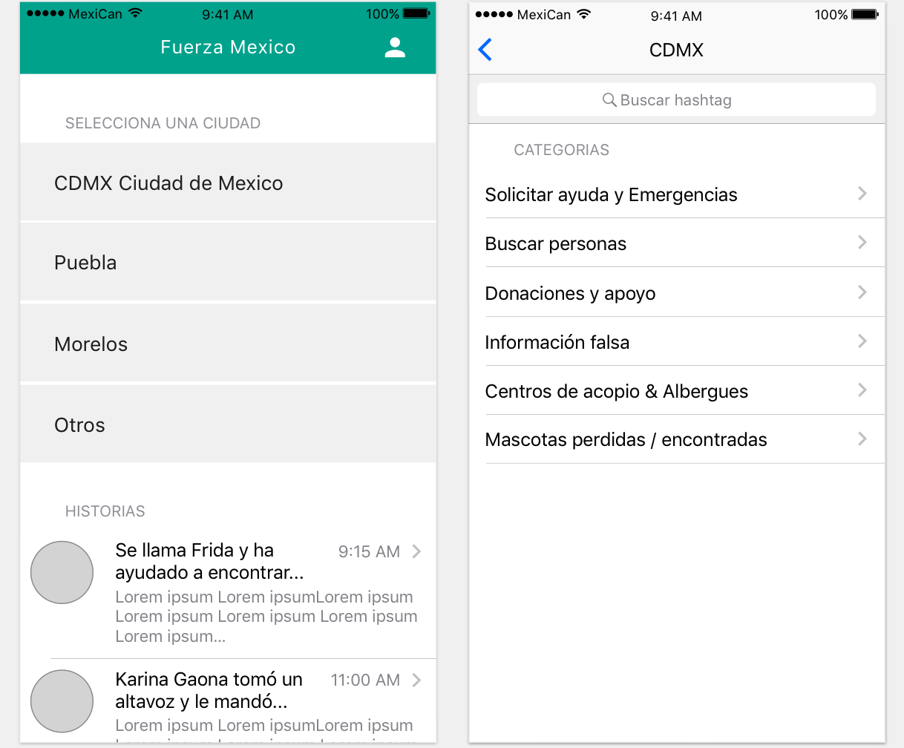
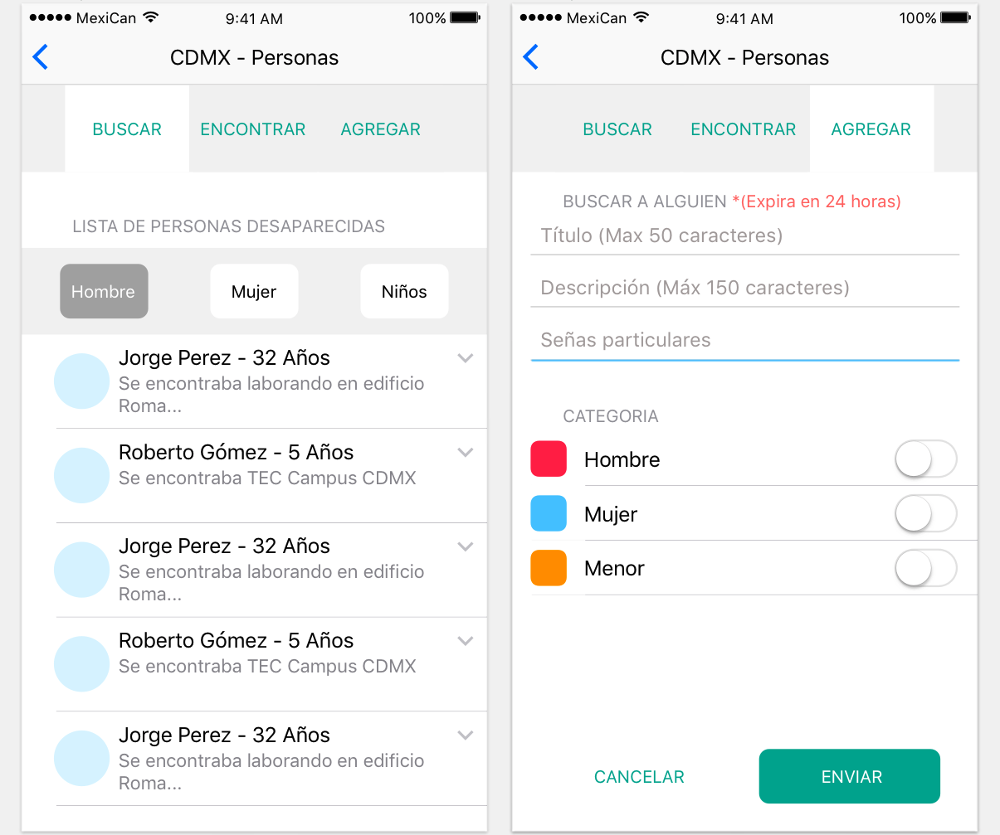
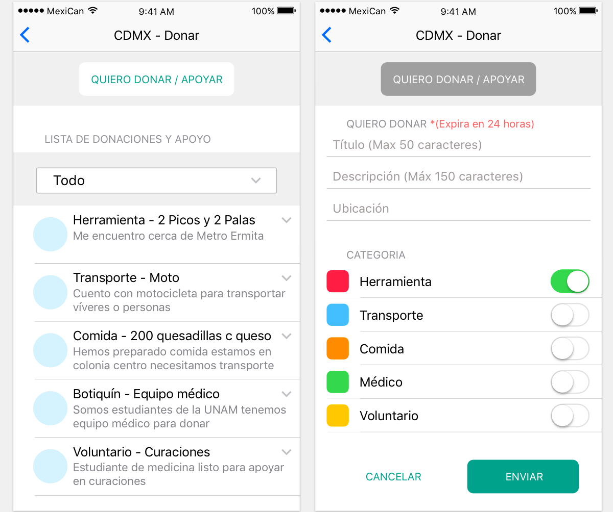
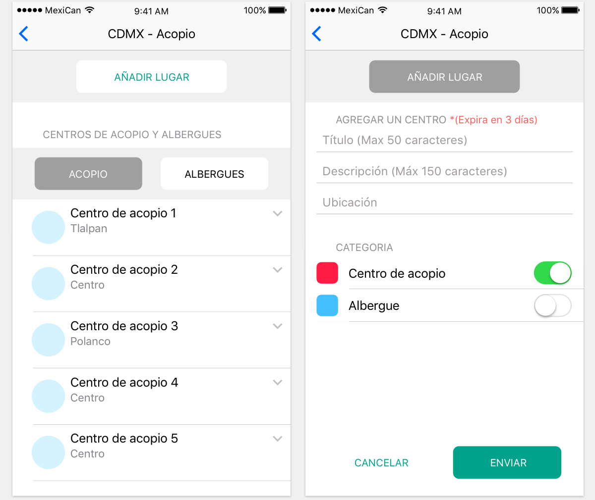
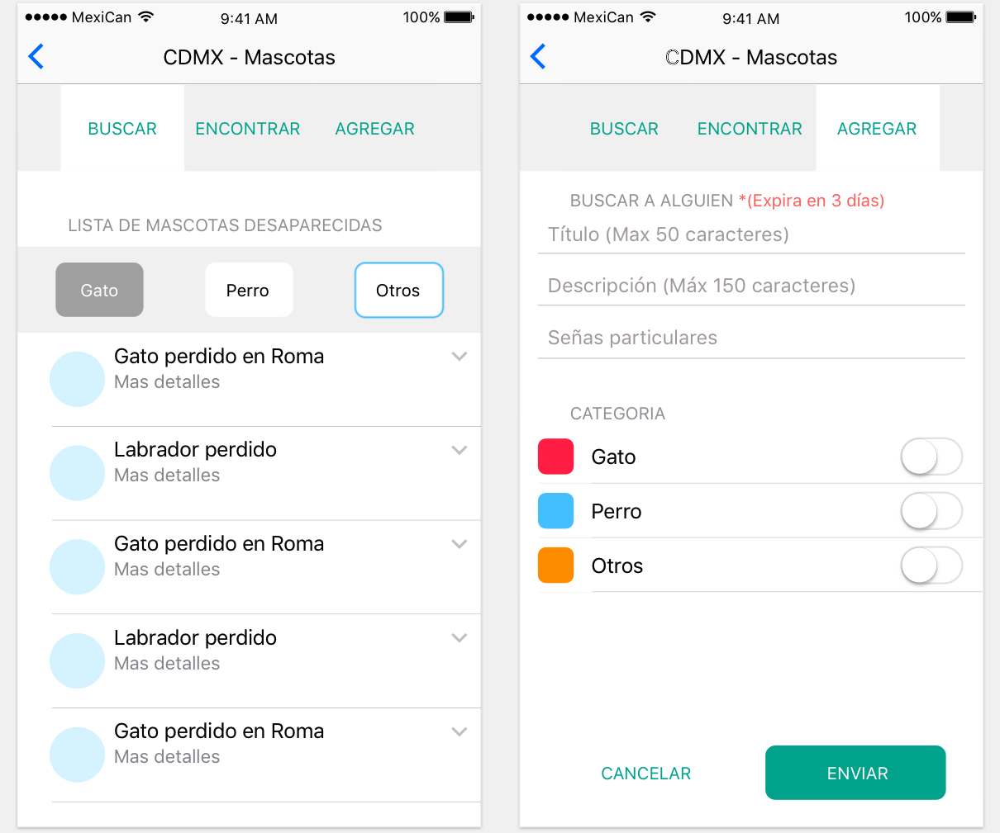
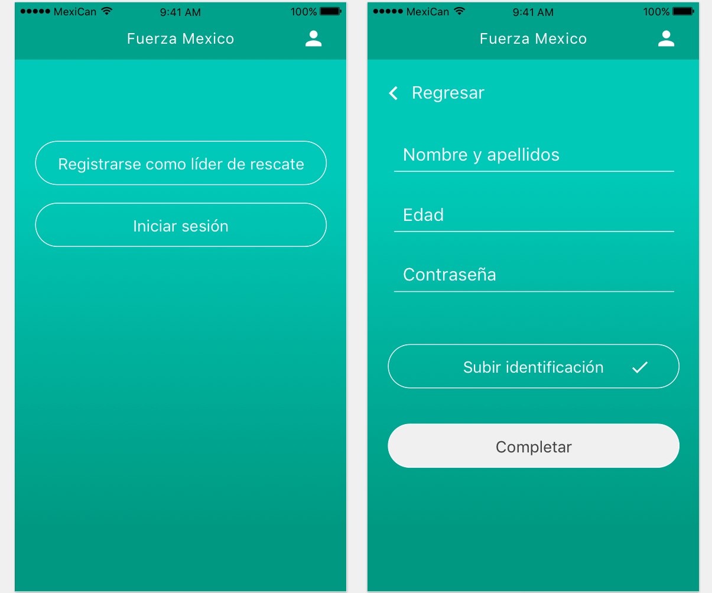

# Fuerza Mexico

Estamos desarrollando una aplicación móvil, para organizar la ayuda necesaria para reconstruir las regiones afectadas después del terremoto del 19 de Septiembre en CDMX, Puebla, Morelos y otros municipios.

El enfoque de la primera versión se desarrollará al rededor de:
- Personas
- Animales
- Edificios
- Centros de acopio

Principales problemas, que estamos enfrentando:
- Validación sobre la veracidad de la información.

## Home Screen and Categories

## People Search Flow

## Donations flow

## Gathering flow

## Pet flow

## Rescue Leaders Flow

# SavingLives

This project was generated with [Angular CLI](https://github.com/angular/angular-cli) version 1.4.1.

## Development server

Run `ng serve` for a dev server. Navigate to `http://localhost:4200/`. The app will automatically reload if you change any of the source files.

## Code scaffolding

Run `ng generate component component-name` to generate a new component. You can also use `ng generate directive|pipe|service|class|guard|interface|enum|module`.

## Build

Run `ng build` to build the project. The build artifacts will be stored in the `dist/` directory. Use the `-prod` flag for a production build.

## Running unit tests

Run `ng test` to execute the unit tests via [Karma](https://karma-runner.github.io).

## Running end-to-end tests

Run `ng e2e` to execute the end-to-end tests via [Protractor](http://www.protractortest.org/).
Before running the tests make sure you are serving the app via `ng serve`.

## Further help

To get more help on the Angular CLI use `ng help` or go check out the [Angular CLI README](https://github.com/angular/angular-cli/blob/master/README.md).
